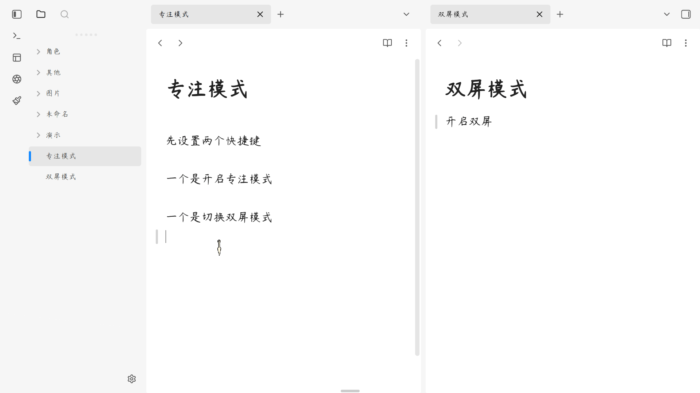
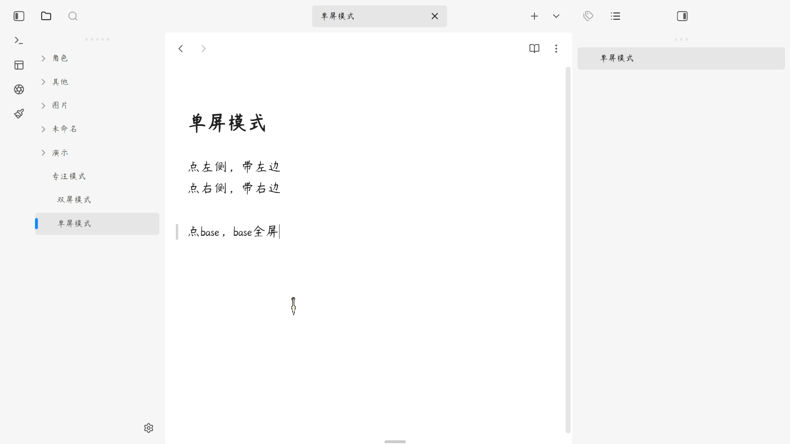

# ✦ 禅模式 ✦

我在小红书发布了许多obsidian的教程和插件开发进度，你的关注就是对我最大的支持

一键进入沉浸式写作环境，让专注回归本质。

  

  

[简体中文](#简体中文) | [用法](#用法) | [English](#english) | [Usage](#usage)

---

## 简体中文

### 核心功能

#### 1. 极简全屏模式
一键进入全屏专注环境，隐藏所有干扰元素，只保留你的文字。

#### 2. 智能属性隐藏
自动隐藏文档顶部的属性区域 (Properties)，让写作更沉浸。

#### 3. 悬浮选项卡设计
去框化的极简选项卡，边缘悬浮文字，解决横向挤压变形问题。

#### 4. 灵活双屏模式
支持单屏独占和双屏对照两种模式，满足不同写作需求。

#### 5. 智能标签定位
可选固定右侧标签或左右分离标签，适配多窗格工作流。

***

## 用法

1. 安装插件后，使用快捷键 `Ctrl/Cmd + Shift + Z` 开启/关闭禅模式。
2. 使用快捷键 `Ctrl/Cmd + Shift + D` 切换单屏/双屏对照模式。
3. 在设置中可自定义各项功能的开关状态。
4. 禅模式下按 `Esc` 键不会退出，确保专注不被打断。

***

### 赞赏支持

🎁 如果觉得有用，请作者喝杯咖啡

 

  

***

### 安装方法

#### 方法一：社区插件安装（推荐）

待插件通过审核并上架社区市场后：
1. 打开 Obsidian **设置** > **社区插件** > **浏览**。
2. 搜索并选择 `Super Zen`。
3. 点击 **安装** 并选择 **启用**。

#### 方法二：手动安装

1. 前往 [Releases](https://github.com/hornat/super-zen/releases) 页面下载最新的 `main.js`、`manifest.json` 和 `styles.css` 文件。
2. 打开您的 Obsidian 库所在的本地文件夹。
3. 进入 `.obsidian/plugins/` 目录，并创建一个名为 `super-zen` 的文件夹。
4. 将下载的三个文件放入该文件夹中。
5. 在 Obsidian **设置** > **社区插件** 中重新加载并开启该插件。

***

QQ 交流群：1094620986

---

## English

**Super Zen** — A minimalist focus mode plugin for Obsidian that creates an immersive writing environment. It hides all distractions, provides a clean fullscreen experience, and helps you maintain deep focus with **zero interruptions**.

***

### Features

#### 1. Minimalist Fullscreen Mode
Enter a fullscreen focus environment with one click, hiding all distracting elements and keeping only your words.

#### 2. Smart Properties Hiding
Automatically hides the document properties area (YAML frontmatter) for a more immersive writing experience.

#### 3. Floating Tab Design
Frameless minimalist tabs with edge-floating text, solving horizontal compression issues.

#### 4. Flexible Dual-Pane Mode
Supports both single-pane exclusive and dual-pane comparison modes to meet different writing needs.

#### 5. Smart Tab Positioning
Optional fixed right-side tabs or left-right separated tabs, adapting to multi-pane workflows.

***

## Usage

1. After installing the plugin, use `Ctrl/Cmd + Shift + Z` to toggle Zen mode on/off.
2. Use `Ctrl/Cmd + Shift + D` to switch between single/dual-pane comparison mode.
3. Customize feature settings in the plugin settings panel.
4. Pressing `Esc` in Zen mode won't exit, ensuring uninterrupted focus.

***

### Installation

#### Method 1: Community Plugins (Recommended)

Once the plugin is reviewed and listed on the community marketplace:
1. Open Obsidian **Settings** > **Community plugins** > **Browse**.
2. Search for and select `Super Zen`.
3. Click **Install** and then **Enable**.

#### Method 2: Manual Installation

1. Go to the [Releases](https://github.com/hornat/super-zen/releases) page to download the latest `main.js`, `manifest.json`, and `styles.css` files.
2. Open your Obsidian vault folder on your computer.
3. Navigate to the `.obsidian/plugins/` directory and create a folder named `super-zen`.
4. Place the downloaded files into this folder.
5. Reload and enable the plugin in Obsidian **Settings** > **Community plugins**.

***

QQ Group: 1094620986
